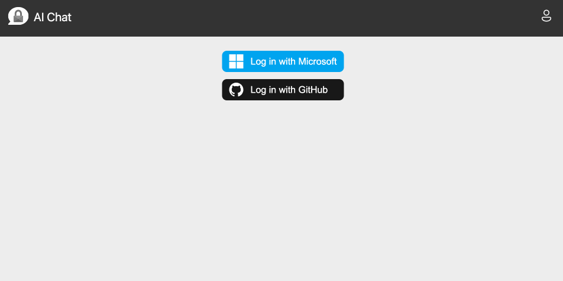
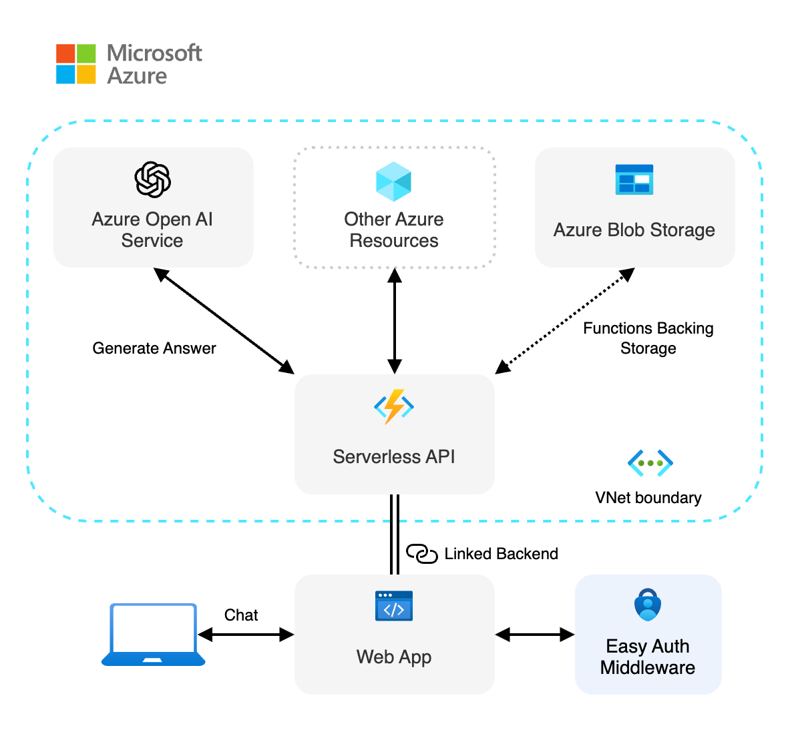
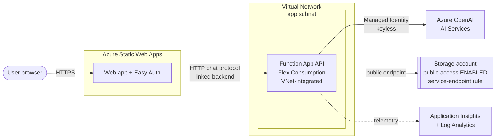
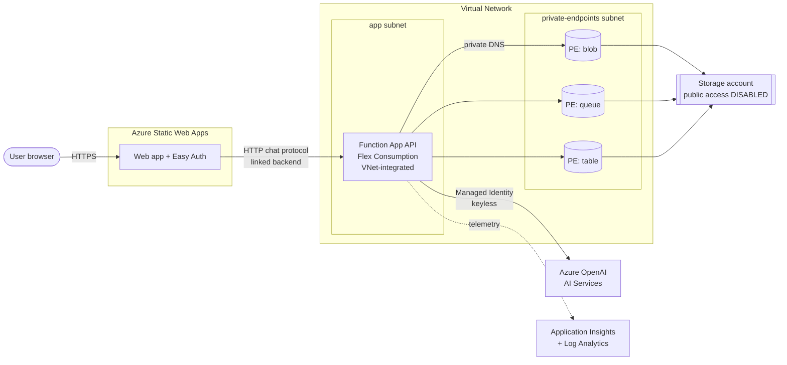
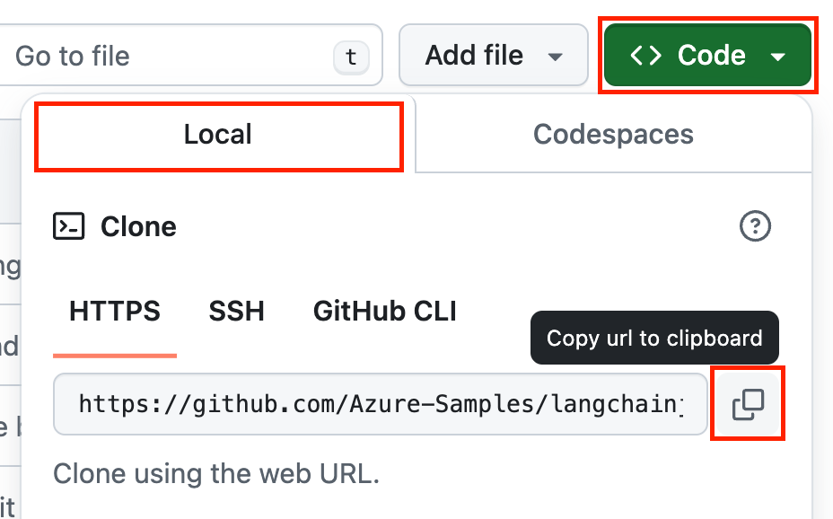
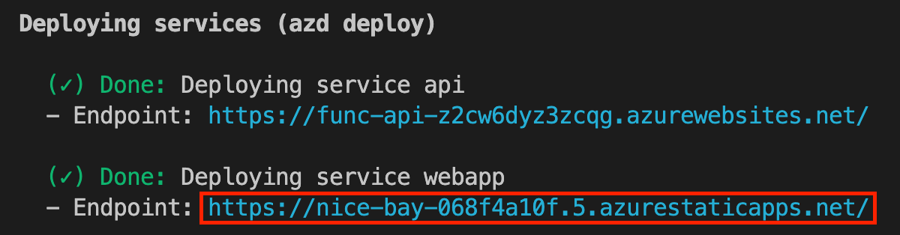

<!-- prettier-ignore -->
<div align="center">


# Azure OpenAI secure UI starter

[](https://codespaces.new/Azure-Samples/openai-secure-ui-js?hide_repo_select=true&ref=main&quickstart=true)
[](https://www.youtube.com/playlist?list=PLlrxD0HtieHi5ZpsHULPLxm839IrhmeDk)
[](https://github.com/Azure-Samples/openai-secure-ui-js/actions)

[](https://www.typescriptlang.org)
[](LICENSE)

:star: If you like this sample, star it on GitHub — it helps a lot!

[Overview](#overview) • [Get started](#getting-started) • [Run the sample](#run-the-sample) • [Resources](#resources) • [FAQ](#faq) • [Guidance](#guidance)



</div>

This sample shows how to deploy a secure [Azure OpenAI](https://learn.microsoft.com/azure/ai-services/openai/overview) infrastructure with reusable components to build a web UI with authentication. It provides a starting point for building secure AI chat applications, using [RBAC](https://learn.microsoft.com/azure/role-based-access-control/built-in-roles) permissions and OpenAI API SDKs with [keyless (Entra) authentication](https://learn.microsoft.com/entra/identity/managed-identities-azure-resources/overview). The backend resources are secured within an [Azure Virtual Network](https://learn.microsoft.com/azure/virtual-network/virtual-networks-overview), and the frontend is hosted on [Azure Static Web Apps](https://learn.microsoft.com/azure/static-web-apps/overview).

## Overview

Building AI applications can be complex and time-consuming, but using accelerator components with Azure allows to greatly simplify the process. This template provides a starting point for building a secure UI with Azure OpenAI, using a keyless authentication mechanism and a virtual network to secure the backend resources. It also demonstrates how to set up user authentication and authorization with configurable providers with [Azure Static Web Apps Easy Auth](https://learn.microsoft.com/azure/static-web-apps/authentication-authorization).

<div align="center">
  
</div>

> [!NOTE]
> **This template's architecture was updated to follow storage network-security best practices.**
> The Function App's deployment storage account now has **public network access disabled** and is
> reached exclusively through **private endpoints** (blob, queue, and table) inside the virtual
> network, with matching **private DNS zones**. This satisfies the common enterprise Azure Policy
> _"Storage accounts should disable public network access"_ (which is enforced as a **Deny** in many
> governed subscriptions), so no keys or public storage endpoints are exposed. The trade-off is that
> `azd deploy api` must run from a client **inside the VNet** — see
> [Deploying in a network-restricted (governed) subscription](#deploying-in-a-network-restricted-governed-subscription).

#### Previous architecture (before the change)

Previously, the deployment storage account had **public network access enabled** (allowed via a
service-endpoint VNet rule), so the Function App could reach it over its public endpoint and
`azd deploy api` worked from anywhere — including Azure Cloud Shell. This is simpler, but it is
**rejected by the "Storage accounts should disable public network access" Deny policy** used in
many governed subscriptions.



#### Updated architecture (after the change)

The updated secure architecture looks like this:



This application is made from multiple components:

- Reusable and customizable web components built with [Lit](https://lit.dev) handling user authentication and providing an AI chat UI. The code is located in the `packages/ai-chat-components` folder.

- Example web app integrations of the web components, hosted on [Azure Static Web Apps](https://learn.microsoft.com/azure/static-web-apps/overview). There are example using [static HTML](./packages/webapp-html/), [React](./packages/webapp-react/), [Angular](./packages/webapp-angular/), [Vue](./packages/webapp-vue/) and [Svelte](./packages/webapp-svelte/).

- A serverless API built with [Azure Functions](https://learn.microsoft.com/azure/azure-functions/functions-overview?pivots=programming-language-javascript) and using [OpenAI SDK](https://github.com/openai/openai-node) to generate responses to the user chat queries. The code is located in the `packages/api` folder.

We use the [HTTP protocol for AI chat apps](https://aka.ms/chatprotocol) to communicate between the web app and the API.

## Features

- **Secure deployments**: Uses Azure Managed Identity for keyless authentication and Azure Virtual Network to secure the backend resources.
- **Reusable components**: Provides reusable web components for building secure AI chat applications.
- **Serverless Architecture**: Utilizes Azure Functions and Azure Static Web Apps for a fully serverless deployment.
- **Scalable and Cost-Effective**: Leverages Azure's serverless offerings to provide a scalable and cost-effective solution.
- **Local Development**: Supports local development using Ollama for testing without any cloud costs.

## Getting started

There are multiple ways to get started with this project.

The quickest way is to use [GitHub Codespaces](#use-github-codespaces) that provides a preconfigured environment for you. Alternatively, you can [set up your local environment](#use-your-local-environment) following the instructions below.

> [!IMPORTANT]
> If you want to run this sample entirely locally using Ollama, you have to follow the instructions in the [local environment](#use-your-local-environment) section.

### Use your local environment

You need to install following tools to work on your local machine:

- [Node.js LTS](https://nodejs.org/download/)
- [Azure Developer CLI](https://aka.ms/azure-dev/install)
- [Git](https://git-scm.com/downloads)
- [PowerShell 7+](https://github.com/powershell/powershell) _(for Windows users only)_
  - **Important**: Ensure you can run `pwsh.exe` from a PowerShell command. If this fails, you likely need to upgrade PowerShell.
  - Instead of Powershell, you can also use Git Bash or WSL to run the Azure Developer CLI commands.

Then you can get the project code:

1. [**Fork**](https://github.com/Azure-Samples/openai-secure-ui-js/fork) the project to create your own copy of this repository.
2. On your forked repository, select the **Code** button, then the **Local** tab, and copy the URL of your forked repository.

<div align="center">
  
</div>
3. Open a terminal and run this command to clone the repo: <code> git clone &lt;your-repo-url&gt; </code>

### Use GitHub Codespaces

You can run this project directly in your browser by using GitHub Codespaces, which will open a web-based VS Code:

[](https://codespaces.new/Azure-Samples/openai-secure-ui-js?hide_repo_select=true&ref&quickstart=true)

### Use a VSCode dev container

A similar option to Codespaces is VS Code Dev Containers, that will open the project in your local VS Code instance using the [Dev Containers extension](https://marketplace.visualstudio.com/items?itemName=ms-vscode-remote.remote-containers).

You will also need to have [Docker](https://www.docker.com/products/docker-desktop) installed on your machine to run the container.

[](https://vscode.dev/redirect?url=vscode://ms-vscode-remote.remote-containers/cloneInVolume?url=https://github.com/Azure-Samples/openai-secure-ui-js)

## Run the sample

There are multiple ways to run this sample: locally using Ollama or Azure OpenAI models for testing, or by deploying it to Azure.

### Deploy the sample to Azure

#### Azure prerequisites

- **Azure account**. If you're new to Azure, [get an Azure account for free](https://azure.microsoft.com/free) to get free Azure credits to get started. If you're a student, you can also get free credits with [Azure for Students](https://aka.ms/azureforstudents).
- **Azure subscription with access enabled for the Azure OpenAI service**. You can request access with [this form](https://aka.ms/oaiapply).
- **Azure account permissions**:
  - Your Azure account must have `Microsoft.Authorization/roleAssignments/write` permissions, such as [Role Based Access Control Administrator](https://learn.microsoft.com/azure/role-based-access-control/built-in-roles#role-based-access-control-administrator-preview), [User Access Administrator](https://learn.microsoft.com/azure/role-based-access-control/built-in-roles#user-access-administrator), or [Owner](https://learn.microsoft.com/azure/role-based-access-control/built-in-roles#owner). If you don't have subscription-level permissions, you must be granted [RBAC](https://learn.microsoft.com/azure/role-based-access-control/built-in-roles#role-based-access-control-administrator-preview) for an existing resource group and deploy to that existing group by running these commands:
    ```bash
    azd env set AZURE_RESOURCE_GROUP <name of existing resource group>
    azd env set AZURE_LOCATION <location of existing resource group>
    ```
  - Your Azure account also needs `Microsoft.Resources/deployments/write` permissions on the subscription level.

> [!NOTE]
> This template deploys the `gpt-5-mini` model (version `2025-08-07`), which isn't available in every
> region. Before you run `azd up`, check that the model and version are available in your target region
> (replace `eastus2` with your region):
>
> ```bash
> az cognitiveservices model list \
>   --location eastus2 \
>   --query "[?kind=='OpenAI'].{Name:model.name, Version:model.version, Format:model.format}" \
>   -o table
> ```
>
> If the version isn't listed, pick an available one from the output and override the defaults before deploying:
>
> ```bash
> azd env set AZURE_OPENAI_API_MODEL gpt-5-mini
> azd env set AZURE_OPENAI_API_MODEL_VERSION <an-available-version>
> ```

#### Cost estimation

See the [cost estimation](./docs/cost.md) details for running this sample on Azure.

#### (Optional) Enable additional user context to Microsoft Defender for Cloud
In case you have Microsoft Defender for Cloud protection on your Azure OpenAI resource and you want to have additional user context on the alerts, run this command:

```bash
azd env set MS_DEFENDER_ENABLED true
```

To customize the application name of the user context, run this command:
```bash
azd env set APPLICATION_NAME <your application name>
```

For more details, refer to the [Microsoft Defender for Cloud documentation](https://learn.microsoft.com/azure/defender-for-cloud/gain-end-user-context-ai).

#### Deploy the sample

1. Open a terminal and navigate to the root of the project.
2. Authenticate with Azure by running `azd auth login`.
3. Run `azd up` to deploy the application to Azure. This will provision Azure resources, deploy this sample, and build the search index based on the files found in the `./data` folder.
   - You will be prompted to select a base location for the resources. If you're unsure of which location to choose, select `eastus2`.
   - By default, the OpenAI resource will be deployed to `eastus2`. You can set a different location with `azd env set AZURE_OPENAI_RESOURCE_GROUP_LOCATION <location>`. Currently only a short list of locations is accepted. That location list is based on the [OpenAI model availability table](https://learn.microsoft.com/azure/ai-services/openai/concepts/models#standard-deployment-model-availability) and may become outdated as availability changes.

The deployment process will take a few minutes. Once it's done, you'll see the URL of the web app in the terminal.

<div align="center">
  
</div>

You can now open the web app in your browser and start chatting with the bot.

##### How `azd up` works

`azd up` is a shortcut that runs three steps in sequence, driven by two files at the root of the project:

- **`azure.yaml`** — the orchestration map. It tells `azd` what your app is made of (the `webapp` and `api` services, their folders, and their Azure hosts), and defines the `hooks` (custom commands) to run at specific stages.
- **`infra/main.bicep`** — the infrastructure blueprint. It describes the Azure resources to create (Azure OpenAI, Function App, Static Web App, Virtual Network, etc.) using Bicep, Azure's Infrastructure as Code language.

When you run `azd up`, it performs the following steps:

1. **Provision** (`azd provision`) — reads `infra/main.bicep` and creates the Azure resources.
2. **Package** (`azd package`) — builds each service's code (this is where the `prepackage` hook in `azure.yaml` runs `npm ci && npm run build:wc`).
3. **Deploy** (`azd deploy`) — uploads the built code to the resources created in step 1.

The `hooks` in `azure.yaml` run at specific points around these steps. For example, the `postprovision` hook writes the deployed resource values into `packages/api/.env` so you can also run the API locally.

> [!TIP]
> In short: `azure.yaml` describes **your app** to the `azd` tool, while `main.bicep` describes the **Azure infrastructure** your app runs on. They work together during `azd up`.

##### (Optional) Using a different framework for the webapp

By default, the sample deploys the static HTML version of the webapp. However, we provide example integrations of the UI web components with different web app frameworks:

- [static HTML](./packages/webapp-html/)
- [React](./packages/webapp-react/)
- [Angular](./packages/webapp-angular/)
- [Vue](./packages/webapp-vue/)
- [Svelte](./packages/webapp-svelte/)

If you want to switch the deployment to use any of these, edit the file `azure.yaml` in the root of the project and changes the project path to the one you want to deploy for the webapp service:

```yaml
services:
  webapp:
    # Change here to the path of the web app you want to deploy,
    # for example, to deploy the React version of the web app
    # change it to ./packages/webapp-react
    project: ./packages/webapp-html
```

#### Clean up

To clean up all the Azure resources created by this sample:

1. Run `azd down --purge`
2. When asked if you are sure you want to continue, enter `y`

The resource group and all the resources will be deleted.

### Run the sample locally with Ollama

If you have a machine with enough resources, you can run this sample entirely locally without using any cloud resources. To do that, you first have to install [Ollama](https://ollama.com) and then run the following commands to download the models on your machine:

```bash
ollama pull phi3
```

> [!NOTE]
> The `phi3` model with download a few gigabytes of data, so it can take some time depending on your internet connection.

After that you have to install the NPM dependencies:

```bash
npm install
```

Next, create a `.env` file in the `packages/api` folder with the following content:

```bash
OPENAI_BASE_URL=http://localhost:11434/v1
OPENAI_API_KEY=__dummy
OPENAI_MODEL_NAME=phi3
```

Then you can start the application by running the following command which will start the web app and the API locally:

```bash
npm start
```

You can now open the URL `http://localhost:4280` in your browser, use the authentication emulator to connect to the web app, and start chatting with the bot.

### Run the sample locally with Azure OpenAI models

First you need to provision the Azure resources needed to run the sample. Follow the instructions in the [Deploy the sample to Azure](#deploy-the-sample-to-azure) section to deploy the sample to Azure, then you'll be able to run the sample locally using the deployed Azure resources.

Once your deployment is complete, you should see a `.env` file in the `packages/api` folder. This file contains the environment variables needed to run the application using Azure resources.

To run the sample, you can then use the same commands as for the Ollama setup. This will start the web app and the API locally:

```bash
npm start
```

Open the URL `http://localhost:4280` in your browser, use the authentication emulator to connect to the web app, and start chatting with the bot.

## Resources

Here are some resources to learn more about Azure OpenAI and related technologies:

- [Serverless AI Chat sample](https://github.com/Azure-Samples/serverless-chat-langchainjs)
- [Generative AI with JavaScript](https://github.com/microsoft/generative-ai-with-javascript)
- [Generative AI For Beginners](https://github.com/microsoft/generative-ai-for-beginners)
- [Azure OpenAI Service](https://learn.microsoft.com/azure/ai-services/openai/overview)
- [Chat + Enterprise data with Azure OpenAI and Azure AI Search](https://github.com/Azure-Samples/azure-search-openai-javascript)

You can also find [more Azure AI samples here](https://github.com/Azure-Samples/azureai-samples).

## FAQ

You can find answers to frequently asked questions in the [FAQ](./docs/faq.md).

## Guidance

### Region availability

This template uses model `gpt-5-mini` which may not be available in all Azure regions. Check for [up-to-date region availability](https://learn.microsoft.com/azure/ai-services/openai/concepts/models#standard-deployment-model-availability) and select a region during deployment accordingly.

We recommend using `East US 2` if you're unsure of which region to choose.

#### Note: choosing a valid Azure OpenAI model and version

The model, model version, and API version are configurable via `azd` environment variables (defaults live in [`infra/main.parameters.json`](./infra/main.parameters.json)):

| Setting | Env variable | Default |
| --- | --- | --- |
| Model name | `AZURE_OPENAI_API_MODEL` | `gpt-5-mini` |
| Model version | `AZURE_OPENAI_API_MODEL_VERSION` | `2025-08-07` |
| API version | `AZURE_OPENAI_API_VERSION` | `2024-02-01` |

Model versions get **deprecated over time**. If `azd up` fails during provisioning with an error like:

```
ServiceModelDeprecating: The model 'Format:OpenAI,Name:gpt-5-mini,Version:2025-08-07' is in deprecating state and cannot be used for new deployments.
```

it means the pinned version is no longer accepted for new deployments. To fix it, list the models currently available in your region and pick a non-deprecated one (check the `Deprecates` column):

```bash
az cognitiveservices model list -l eastus2 --query "sort_by([?kind=='OpenAI' && starts_with(model.name,'gpt')].{Name:model.name, Version:model.version, Deprecates:model.deprecation.inference}, &Name)" -o table
```

Then override the values (no file edit required) and redeploy:

```bash
azd env set AZURE_OPENAI_API_MODEL <a-non-deprecated-model>
azd env set AZURE_OPENAI_API_MODEL_VERSION <a-non-deprecated-version>
azd up
```

### Security

This template has [Managed Identity](https://learn.microsoft.com/entra/identity/managed-identities-azure-resources/overview) built in to eliminate the need for developers to manage these credentials. Applications can use managed identities to obtain Microsoft Entra tokens without having to handle any secrets in the code. Additionally, we're using [Microsoft Security DevOps GitHub Action](https://github.com/microsoft/security-devops-action) to scan the infrastructure-as-code files and generates a report containing any detected issues.

### Security

This template has [Managed Identity](https://learn.microsoft.com/entra/identity/managed-identities-azure-resources/overview) built in to eliminate the need for developers to manage these credentials. Applications can use managed identities to obtain Microsoft Entra tokens without having to handle any secrets in the code. Additionally, we're using [Microsoft Security DevOps GitHub Action](https://github.com/microsoft/security-devops-action) to scan the infrastructure-as-code files and generates a report containing any detected issues.

You can Learn more about using Managed Identity with Azure OpenAI in this [tutorial](https://learn.microsoft.com/training/modules/intro-azure-openai-managed-identity-auth-javascript/).

### Deploying in a network-restricted (governed) subscription

This template is **secure by default**: the Function App runs on the Flex Consumption plan
and its deployment storage account has **public network access disabled**. The storage
account is reached only through **private endpoints** (blob, queue, and table) that live in
the `private-endpoints` subnet of the VNet, with matching **private DNS zones** so the
`privatelink.*.core.windows.net` names resolve to private IPs from inside the VNet.

This design satisfies the common enterprise Azure Policy
**"Storage accounts should disable public network access"** (built-in
`b2982f36-99f2-4db5-8eff-283140c09693`), which is assigned as a **Deny** in many corporate
subscriptions. Because of this, you **cannot** simply enable public access on the storage
account — the policy will reject it.

#### Why three private endpoints (blob, queue, and table)?

A storage account exposes each service on its **own hostname and private-link sub-resource**, and
a single private endpoint only covers **one** service (`groupId`). When public access is disabled,
any service **without** a private endpoint stops resolving to a private IP and becomes unreachable:

| Service | Hostname | Private DNS zone |
| --- | --- | --- |
| Blob | `<account>.blob.core.windows.net` | `privatelink.blob.core.windows.net` |
| Queue | `<account>.queue.core.windows.net` | `privatelink.queue.core.windows.net` |
| Table | `<account>.table.core.windows.net` | `privatelink.table.core.windows.net` |

Azure Functions on the **Flex Consumption** plan uses all three services on this account:

- **Blob** — holds the **deployment package** (`azd deploy api` uploads here) and is used by
  `AzureWebJobsStorage` for the host's internal state.
- **Queue** — used by the Functions host/runtime for internal coordination and by queue-based triggers.
- **Table** — used by the host for metadata/state (e.g. trigger receipts and lease/partition tracking).

If you only create the blob private endpoint, provisioning may appear to succeed but the host can
intermittently fail to start or run because it can't reach queue/table. Creating all three (plus
their DNS zones) is the supported "secure by default" configuration. For details, see Microsoft's
[Azure Functions networking options — restrict your storage account to a virtual network](https://learn.microsoft.com/azure/azure-functions/functions-networking-options#restrict-your-storage-account-to-a-virtual-network)
and [Flex Consumption plan networking](https://learn.microsoft.com/azure/azure-functions/flex-consumption-plan#networking).

**What this means for deployment:** `azd deploy api` uploads the app package to the
deployment storage account. Since that account is private-endpoint-only, the upload must
originate from a client that is **inside the VNet**. A machine outside the VNet — including
**Azure Cloud Shell** — cannot reach the storage account and the deploy will fail with a
`403`/network error.

To deploy `api` in a governed subscription, run `azd` from a client with a network path
into the VNet, for example:

- A **jumpbox VM** deployed into a subnet of the same VNet (`vnet-*`), with `azd`, Node.js,
  and the Azure CLI installed, or
- A **CI/CD runner** (GitHub Actions self-hosted runner or Azure DevOps agent) that is
  **VNet-integrated** into the same network.

`azd provision` (creating/updating the infrastructure) can still be run from anywhere,
since it only calls the Azure control plane. It is only the `azd deploy api` step (data-plane
upload to private storage) that must run from inside the VNet.

> [!TIP]
> If your organization instead grants you a policy **exemption** for the storage account,
> you could allow public access with IP/service-endpoint rules — but the exemption route is
> usually not available in governed subscriptions, so the private-endpoint path above is the
> supported approach.

### Troubleshooting

If you have any issue when running or deploying this sample, please check the [troubleshooting guide](./docs/troubleshooting.md). If you can't find a solution to your problem, please [open an issue](https://github.com/Azure-Samples/openai-secure-ui-js/issues) in this repository.

## Contributing

This project welcomes contributions and suggestions. Most contributions require you to agree to a
Contributor License Agreement (CLA) declaring that you have the right to, and actually do, grant us
the rights to use your contribution. For details, visit https://cla.opensource.microsoft.com.

When you submit a pull request, a CLA bot will automatically determine whether you need to provide
a CLA and decorate the PR appropriately (e.g., status check, comment). Simply follow the instructions
provided by the bot. You will only need to do this once across all repos using our CLA.

This project has adopted the [Microsoft Open Source Code of Conduct](https://opensource.microsoft.com/codeofconduct/).
For more information see the [Code of Conduct FAQ](https://opensource.microsoft.com/codeofconduct/faq/) or
contact [opencode@microsoft.com](mailto:opencode@microsoft.com) with any additional questions or comments.

## Trademarks

This project may contain trademarks or logos for projects, products, or services. Authorized use of Microsoft
trademarks or logos is subject to and must follow
[Microsoft's Trademark & Brand Guidelines](https://www.microsoft.com/en-us/legal/intellectualproperty/trademarks/usage/general).
Use of Microsoft trademarks or logos in modified versions of this project must not cause confusion or imply Microsoft sponsorship.
Any use of third-party trademarks or logos are subject to those third-party's policies.
