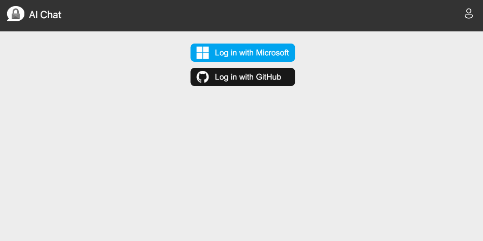
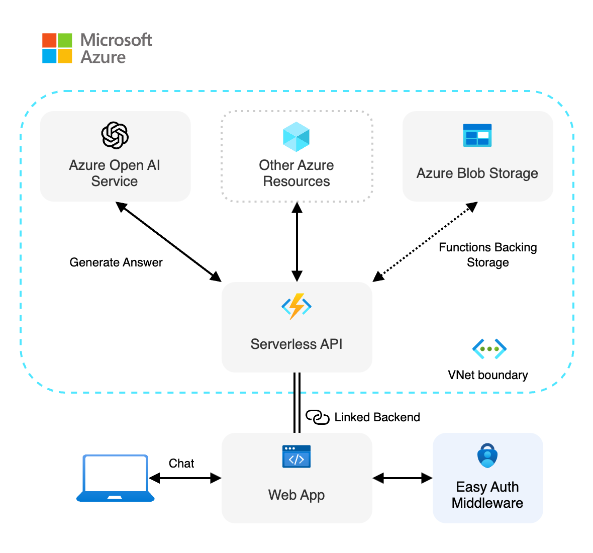
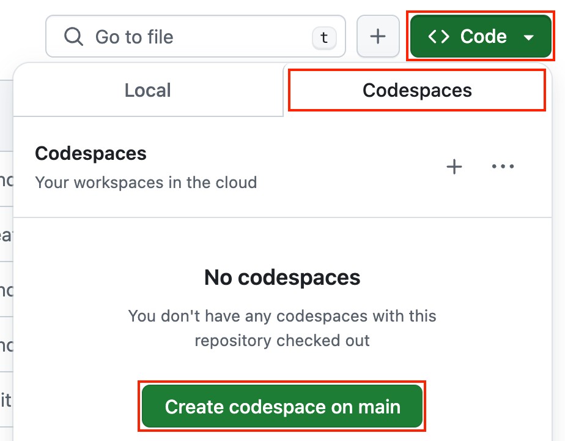

<!-- Learn samples onboarding: https://review.learn.microsoft.com/en-us/help/contribute/samples/process/onboarding?branch=main -->
<!-- prettier-ignore -->
This sample shows how to deploy a secure [Azure OpenAI](https://learn.microsoft.com/azure/ai-services/openai/overview) infrastructure with reusable components to build a web UI with authentication. It provides a starting point for building secure AI chat applications, using [RBAC](https://learn.microsoft.com/azure/role-based-access-control/built-in-roles) permissions and OpenAI API SDKs with [keyless (Entra) authentication](https://learn.microsoft.com/entra/identity/managed-identities-azure-resources/overview). The backend resources are secured within an [Azure Virtual Network](https://learn.microsoft.com/azure/virtual-network/virtual-networks-overview), and the frontend is hosted on [Azure Static Web Apps](https://learn.microsoft.com/azure/static-web-apps/overview).



## Overview

Building AI applications can be complex and time-consuming, but using accelerator components with Azure allows to greatly simplify the process. This template provides a starting point for building a secure UI with Azure OpenAI, using a keyless authentication mechanism and a virtual network to secure the backend resources. It also demonstrates how to set up user authentication and authorization with configurable providers with [Azure Static Web Apps Easy Auth](https://learn.microsoft.com/azure/static-web-apps/authentication-authorization).




This application is made from multiple components:

- Reusable and customizable web components built with [Lit](https://lit.dev) handling user authentication and providing an AI chat UI. The code is located in the `packages/ai-chat-components` folder.

- Example web app integrations of the web components, hosted on [Azure Static Web Apps](https://learn.microsoft.com/azure/static-web-apps/overview). There are example using [static HTML](./packages/webapp-html/), [React](./packages/web-app-react/), [Angular](./packages/webapp-angular/), [Vue](./packages/webapp-vue/) and [Svelte](./packages/webapp-svelte/).

- A serverless API built with [Azure Functions](https://learn.microsoft.com/azure/azure-functions/functions-overview?pivots=programming-language-javascript) and using [OpenAI SDK](https://github.com/openai/openai-node) to generate responses to the user chat queries. The code is located in the `packages/api` folder.

We use the [HTTP protocol for AI chat apps](https://aka.ms/chatprotocol) to communicate between the web app and the API.

## Prerequisites

- [Node.js LTS](https://nodejs.org/download/)
- [Azure Developer CLI](https://aka.ms/azure-dev/install)
- [Git](https://git-scm.com/downloads)
- [PowerShell 7+](https://github.com/powershell/powershell) _(for Windows users only)_
  - **Important**: Ensure you can run `pwsh.exe` from a PowerShell command. If this fails, you likely need to upgrade PowerShell.
  - Instead of Powershell, you can also use Git Bash or WSL to run the Azure Developer CLI commands.
- Azure account. If you're new to Azure, [get an Azure account for free](https://azure.microsoft.com/free) to get free Azure credits to get started. If you're a student, you can also get free credits with [Azure for Students](https://aka.ms/azureforstudents).
- Azure subscription with access enabled for the Azure OpenAI service. You can request access with [this form](https://aka.ms/oaiapply).
- Azure account permissions:
  - Your Azure account must have `Microsoft.Authorization/roleAssignments/write` permissions, such as [Role Based Access Control Administrator](https://learn.microsoft.com/azure/role-based-access-control/built-in-roles#role-based-access-control-administrator-preview), [User Access Administrator](https://learn.microsoft.com/azure/role-based-access-control/built-in-roles#user-access-administrator), or [Owner](https://learn.microsoft.com/azure/role-based-access-control/built-in-roles#owner). If you don't have subscription-level permissions, you must be granted [RBAC](https://learn.microsoft.com/azure/role-based-access-control/built-in-roles#role-based-access-control-administrator-preview) for an existing resource group and deploy to that existing group by running these commands:
    ```bash
    azd env set AZURE_RESOURCE_GROUP <name of existing resource group>
    azd env set AZURE_LOCATION <location of existing resource group>
    ```
  - Your Azure account also needs `Microsoft.Resources/deployments/write` permissions on the subscription level.

## Setup the sample

You can run this project directly in your browser by using GitHub Codespaces, which will open a web-based VS Code.

1. [**Fork**](https://github.com/Azure-Samples/openai-secure-ui-js/fork) the project to create your own copy of this repository.
2. On your forked repository, select the **Code** button, then the **Codespaces** tab, and clink on the button **Create codespace on main**.
   
3. Wait for the Codespace to be created, it should take a few minutes.

## Deploy on Azure

1. Open a terminal and navigate to the root of the project.
2. Authenticate with Azure by running `azd auth login`.
3. Run `azd up` to deploy the application to Azure. This will provision Azure resources, deploy this sample, and build the search index based on the files found in the `./data` folder.
   - You will be prompted to select a base location for the resources. If you're unsure of which location to choose, select `eastus2`.
   - By default, the OpenAI resource will be deployed to `eastus2`. You can set a different location with `azd env set AZURE_OPENAI_RESOURCE_GROUP_LOCATION <location>`. Currently only a short list of locations is accepted. That location list is based on the [OpenAI model availability table](https://learn.microsoft.com/azure/ai-services/openai/concepts/models#standard-deployment-model-availability) and may become outdated as availability changes.

The deployment process will take a few minutes. Once it's done, you'll see the URL of the web app in the terminal.


You can now open the web app in your browser and start chatting with the bot.

## Clean up

To clean up all the Azure resources created by this sample:

1. Run `azd down --purge`
2. When asked if you are sure you want to continue, enter `y`

The resource group and all the resources will be deleted.

## Troubleshooting

If you have any issue when running or deploying this sample, please check the [troubleshooting guide](./troubleshooting.md). If you can't find a solution to your problem, please [open an issue](https://github.com/Azure-Samples/openai-secure-ui-js/issues) in this repository.

## Security

This sample has [Managed Identity](https://learn.microsoft.com/entra/identity/managed-identities-azure-resources/overview) built in to eliminate the need for developers to manage these credentials. Applications can use managed identities to obtain Microsoft Entra tokens without having to handle any secrets in the code. Additionally, we're using [Microsoft Security DevOps GitHub Action](https://github.com/microsoft/security-devops-action) to scan the infrastructure-as-code files and generates a report containing any detected issues.

You can Learn more about using Managed Identity with Azure OpenAI in this [tutorial](https://learn.microsoft.com/training/modules/intro-azure-openai-managed-identity-auth-javascript/).

## Next steps

Here are some resources to learn more about the technologies used in this sample:

- [Serverless AI Chat sample](https://github.com/Azure-Samples/serverless-chat-langchainjs)
- [Generative AI with JavaScript](https://github.com/microsoft/generative-ai-with-javascript)
- [Generative AI For Beginners](https://github.com/microsoft/generative-ai-for-beginners)
- [Azure OpenAI Service](https://learn.microsoft.com/azure/ai-services/openai/overview)
- [Chat + Enterprise data with Azure OpenAI and Azure AI Search](https://github.com/Azure-Samples/azure-search-openai-javascript)

You can also find [more Azure AI samples here](https://github.com/Azure-Samples/azureai-samples).
